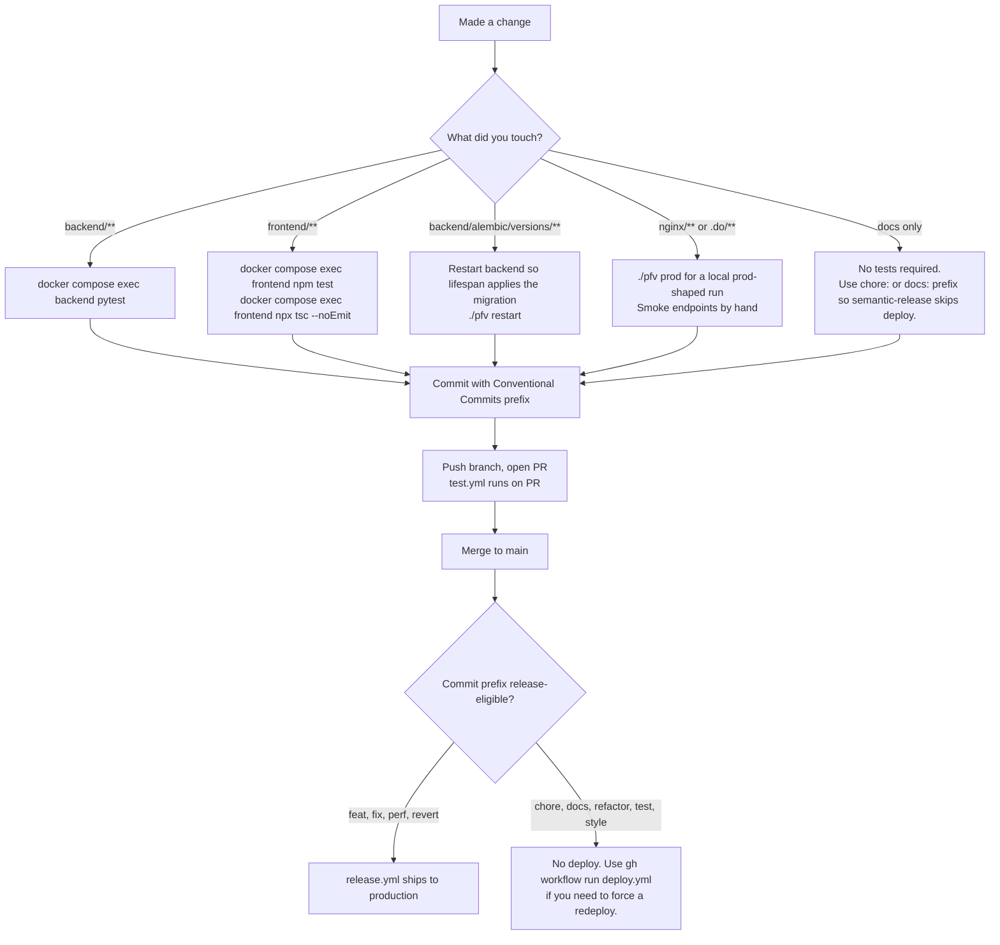

# Contributing to The Better Decision

This guide gets a new contributor productive in under 30 minutes: local stack up, tests passing, first PR ready to push. For deep references, follow the cross-links instead of reading this file end-to-end.

Sibling docs you will end up at:

- `README.md` for product overview and stack.
- `ENVIRONMENT.md` for every env var, with scopes, defaults, and failure modes.
- `DEPLOYMENT.md` for the full CI/CD pipeline (what fires when, how production deploys, smoke tests, apex domain).
- `infra/README.md` and `infra/MIGRATION.md` for the production data plane and Terraform workflow.
- `BRAND.md` and `DESIGN.md` for product copy and UI conventions.

## Prerequisites

- Docker and Docker Compose.
- Git.
- Node.js 22+ on the host (only needed if you want `tsc` outside the container). The app itself runs entirely in containers.

## Quickstart (under 30 minutes)

```bash
# 1. Clone and configure
git clone https://github.com/fjcloudaiconsulting/tbd.git && cd tbd
cp .env.example .env

# 2. Generate a real JWT secret. The backend refuses to boot on the placeholder.
python -c "import secrets; print(secrets.token_urlsafe(64))"
# Paste that value into JWT_SECRET_KEY in .env

# 3. Start the dev stack (MySQL + Redis + backend + frontend + nginx)
./pfv start

# 4. Open the app
open http://localhost
```

The first user to register becomes the org owner and superadmin. No seed data required.

Want a realistic dataset (5 accounts, 100+ transactions, recurring templates, budgets)?

```bash
./pfv seed                 # creates demo / demo1234
```

For a custom user, set `SEED_*` env vars before the command. See [Seeding mock data](#seeding-mock-data) below.

Full env var reference, including production-only and feature-flag variables, lives in `ENVIRONMENT.md`. Do not duplicate values here.

## Your first PR



If you touched migrations, run `docker compose exec backend alembic current` and `docker compose exec backend alembic upgrade head` inside the container to confirm. See [Database migrations](#database-migrations).

## Conventional Commits and the deploy gate

This repo is auto-deployed by `semantic-release` on push to `main`. The commit prefix is the deploy decision, not a stylistic detail.

| Prefix | Release? | What ships |
|--------|----------|------------|
| `feat:` | Yes (minor bump) | App Platform redeploy + smoke tests |
| `fix:` | Yes (patch bump) | App Platform redeploy + smoke tests |
| `perf:` | Yes (patch bump) | App Platform redeploy + smoke tests |
| `revert:` | Yes (patch bump) | App Platform redeploy + smoke tests |
| `feat!:`, `BREAKING CHANGE:` footer | Yes (major bump) | App Platform redeploy + smoke tests |
| `chore:`, `docs:`, `refactor:`, `test:`, `style:`, `ci:`, `build:` | No | Nothing. CI runs `test.yml` only. |

Scope is freeform (`feat(admin):`, `fix(frontend):`, `chore(.do):`). Scope does not change release behavior.

Rules in practice:

- If your change should reach production on merge, use `feat:`, `fix:`, or `perf:`.
- If your change is internal only (refactor, test fix, doc edit, CI tweak, dependency bump), use `chore:` / `docs:` / `refactor:` / `test:`. The merge will not redeploy. This is the right answer most of the time for non-product changes.
- Infra-only changes (`chore(.do)`, `chore(infra)`, `chore(nginx)`) sometimes need to ship without a version bump. Use the manual escape hatch: `gh workflow run deploy.yml --ref main`. See `DEPLOYMENT.md` for when this is appropriate.

Full pipeline detail (path filters, gating logic, smoke tests, apex deploy) lives in `DEPLOYMENT.md`. The short version is in [CI on your PR vs CI after merge](#ci-on-your-pr-vs-ci-after-merge) below.

## CI on your PR vs CI after merge

PR push (any branch):

- `.github/workflows/test.yml` runs on changes under `backend/**`, `frontend/**`, or `.github/workflows/test.yml`. Backend: `pytest` + compileall syntax smoke. Frontend: lint, design-token check, `vitest`/`jest`, production build.
- Nothing deploys. Nothing reaches production.

Merge to `main`:

- `.github/workflows/release.yml` runs on changes under `backend/**`, `frontend/**`, `nginx/**`, `.do/**`, or `Dockerfile*`. It runs `semantic-release`. If (and only if) `semantic-release` decides a new release is warranted, the gated `deploy` job pushes `.do/app.yaml` to DO App Platform, then `scripts/smoke-test.sh` asserts the live app serves traffic.
- `chore:` / `docs:` / `refactor:` commits inside the allowlist still trigger `release.yml`, but `semantic-release` no-ops and the deploy job is skipped.
- `.github/workflows/apex-deploy.yml` deploys the apex landing site (`thebetterdecision.com`) to AWS S3 + CloudFront on merges that touch the apex path filter. Independent of the DO release pipeline; landing-only commits never fire the DO redeploy.

If you need to force a redeploy of the current production spec without merging a code change, use the manual workflow:

```bash
gh workflow run deploy.yml --ref main
```

`DEPLOYMENT.md` is the authoritative reference.

## Working in parallel agent sessions

If you dispatch Claude Code agents (or any parallel-process helpers) against this repo, never let them run backend tests or migrations against the default `pfv` Docker Compose project. They will write to your local MySQL volume. Use an isolated compose project name on every command:

```bash
docker compose -p team-<unique-name> up -d backend mysql redis
docker compose -p team-<unique-name> exec backend pytest tests/...
```

A single command that omits `-p team-<name>` falls back to the default `pfv` project and contaminates the user's stack. `./pfv migrate` has no `-p` flag and always targets the default project, so agents must not invoke it either. See `CLAUDE.md` for the full rule and the 2026-05-09 incident this guard prevents.

## Seeding mock data

```bash
./pfv seed                                       # default demo user
SEED_USERNAME=alice SEED_PASSWORD=alice1234 \
SEED_EMAIL=alice@example.com SEED_ORG="Alice LLC" \
./pfv seed                                       # custom user
```

The seed script logs in as the user, registering them first if they do not exist, and then creates data through the API. If the user already exists, it adds data to their org.

### Determinism (TBD-345)

The dataset is **deterministic for a given anchor date and RNG seed, on a fresh database**:

```bash
SEED_ANCHOR_DATE=2026-03-17 SEED_RANDOM_SEED=42 ./pfv seed
```

`SEED_ANCHOR_DATE` defaults to today; `SEED_RANDOM_SEED` defaults to a fixed constant, so two runs on the same day already agree. Both **raise** on a malformed value rather than silently falling back, because a caller that believes it pinned an anchor while actually running on the wall clock is the exact defect the knobs exist to remove.

⚠ **Deterministic is not idempotent.** Re-running against an already-seeded org **appends** a second dataset: `POST /api/v1/accounts` has no duplicate-name check, so five more accounts and another set of transactions are created. A re-run at a *different* anchor additionally leaves a **second open billing period** — the containment check cannot reject an existing open row that starts earlier than the one being posted, so that POST answers `created` rather than any 409. Run `./pfv reset` first if you want exactly the dataset described here.

Two dataset regimes are worth knowing when reading seeded data. Both are fully deterministic once the anchor is pinned; the split is a documented property, not a defect:

| Anchor day | Closed billing periods | Open period starts |
|-----------|------------------------|--------------------|
| 1-24      | 2                      | 24th of the previous month |
| 25-31     | 3                      | 25th of the anchor's month |

Before each login attempt the script marks that user's email verified with a direct `UPDATE` on `users` (`ensure_verified()` in `backend/seed.py`). `POST /api/v1/auth/login` refuses any account with an unverified email and a dev stack has no mailbox to click the link in, so without that step the script cannot sign in at all. It is the one thing seeding does outside the API, and it is a precondition rather than data — everything the script actually seeds still goes through the HTTP endpoints. A `SEED_USERNAME=alice` run creates a *second* user, which is not covered by the first-user verification bypass on `/register`, so it depends on this step.

`SEED_*` env var reference:

| Variable | Default |
|----------|---------|
| `SEED_USERNAME` | `demo` |
| `SEED_PASSWORD` | `demo1234` |
| `SEED_EMAIL` | `demo@example.com` |
| `SEED_FIRST_NAME` | `Demo` |
| `SEED_LAST_NAME` | `User` |
| `SEED_ORG` | `Demo Household` |
| `SEED_ANCHOR_DATE` | today (ISO `YYYY-MM-DD`; raises if malformed) |
| `SEED_RANDOM_SEED` | `20260101` (integer; raises if malformed) |

## CLI reference

| Command | Description |
|---------|-------------|
| `./pfv start` | Build and start all dev services |
| `./pfv stop` | Stop all services |
| `./pfv restart` | Restart without rebuild |
| `./pfv rebuild` | Force rebuild (no cache) and start |
| `./pfv reset` | Destroy all data, rotate JWT secret, start fresh |
| `./pfv prod` | Build and start a local prod-shaped stack |
| `./pfv migrate` | Run pending DB migrations (local only) |
| `./pfv logs [svc]` | Tail logs (`backend`, `frontend`, `nginx`, `mysql`, `redis`) |
| `./pfv status` | Container status |
| `./pfv shell [svc]` | Shell into a service (default: `backend`) |
| `./pfv seed` | Populate with mock data |

## Architecture

```
Browser --> nginx (:80) --> /api/*  --> backend (FastAPI :8000) --> MySQL (:3306)
                        --> /*      --> frontend (Next.js :3000)
                                        backend --> Redis (:6379)
```

In production (DigitalOcean App Platform), nginx is replaced by DO's built-in ingress. MySQL and Redis are self-hosted on a single droplet (`<data-droplet>`) in a private VPC. Background and runbook: `infra/README.md`, `infra/MIGRATION.md`.

### Backend layout

```
backend/app/
├── main.py          # FastAPI app, lifespan, CORS, router registration
├── config.py        # pydantic-settings, all config from env vars
├── database.py      # async SQLAlchemy engine + session factory
├── security.py      # JWT encode/decode, bcrypt hash/verify
├── deps.py          # FastAPI dependencies: get_db, get_current_user
├── logging.py       # structlog JSON setup
├── models/          # SQLAlchemy ORM models
├── schemas/         # Pydantic request/response models
├── routers/         # API route handlers (one file per resource)
└── services/        # Business logic called by routers
```

### Frontend layout

```
frontend/
├── app/             # Next.js App Router pages (one folder per route)
├── components/      # React components, grouped by feature
└── lib/
    ├── api.ts       # Typed fetch wrapper with Bearer token + silent refresh
    ├── types.ts     # Shared TypeScript interfaces
    ├── styles.ts    # Tailwind class constants (btnPrimary, card, input, ...)
    ├── auth.ts      # isAdmin() / role helpers
    └── validation.ts # Client-side validation mirroring backend schemas
```

For the full router-by-router and service-by-service map, see the live file tree under `backend/app/` and `frontend/app/`. We intentionally do not duplicate the directory listing in this doc because it ages out within weeks.

### Key design decisions

- **All config via env vars.** `pydantic-settings` in backend, `NEXT_PUBLIC_` prefix in frontend. See `ENVIRONMENT.md`.
- **Stateless backend.** No in-memory state. JWT for auth. Ready for horizontal scaling.
- **Migrations auto-run on startup in dev.** In production they run as a `PRE_DEPLOY` job (App Platform) or initContainer (k8s) before the app starts. See [Database migrations](#database-migrations).
- **First user is superadmin.** No bootstrap seed needed.
- **Org-scoped data.** Every query filters by `org_id`.
- **API versioned at `/api/v1/`.** Breaking changes ship as `/api/v2/` while v1 stays live.
- **Auth on every endpoint.** Use `get_current_user`. The public set is enumerated under [Public endpoints](#public-endpoints-no-auth-required) below.
- **Hierarchical categories.** Master categories for budgets, subcategories as transaction tags. Type (income / expense / both) is enforced server-side; once a category is used the UI locks the type.
- **Transfer category invariant.** Transfer legs require a `CategoryType.BOTH` category (seeded as `Transfer`).
- **Billing periods.** Org-level month close date. `COALESCE(settled_date, date)` determines which period a transaction counts against.
- **Audit trail.** Sensitive admin and org actions (rename, wipe, override sweep, role edits) write to `audit_events` and surface at `/admin/audit`.

## Authentication and security

### Auth flow

1. **Login.** `POST /api/v1/auth/login` with username/email + password, or Google SSO via `/api/v1/auth/google`.
2. **MFA challenge** (if enabled). Returns `mfa_token`, user completes TOTP, recovery code, or email verification.
3. **Tokens issued.** Access token (15 min, response body) + refresh token (7 day, httpOnly cookie).
4. **Silent refresh.** Frontend auto-refreshes via `POST /api/v1/auth/refresh` on 401.
5. **Absolute session lifetime.** Sessions expire after `SESSION_LIFETIME_DAYS` (default 30) regardless of refresh activity.

### SSO password security

Google-SSO users have `password_set=False` until they explicitly set a password. To prevent a hijacked SSO session from silently attaching a password:

- **First password set** requires a Google **step-up** verification. The user re-authenticates with the same Google account, the backend issues a 5-minute single-use step-up token, and only then accepts the password write.
- **Reset password via email token** (the standard `/forgot-password` then `/reset-password` flow) flips `password_set=True` on success.
- **Step-up callbacks** redirect through a server-side allowlist of `return_to` keys. Arbitrary URLs are rejected with `400 Malformed step-up state`.
- **Email change** also takes the step-up path and flips `password_set` back to `False` if the new email belongs to a different identity.

### MFA

- TOTP via authenticator app (Google Authenticator, Authy, 1Password).
- 8 single-use recovery codes (HMAC-SHA256 hashed, downloadable).
- Email fallback with 6-digit code (10-minute expiry).
- TOTP secrets encrypted at rest via Fernet (`MFA_ENCRYPTION_KEY`).
- Setup and disable via `/settings/security`.

### Rate limiting

All limits are per client IP via slowapi. Production and Docker Compose use Redis / Valkey-backed storage (shipped in K8S-1, see `backend/app/rate_limit.py`); in-memory storage is the fallback when `REDIS_URL` is empty. Storage errors fail open so a Redis blip never blocks legitimate traffic.

| Endpoint | Limit |
|----------|-------|
| `POST /api/v1/auth/login` | 10/minute |
| `POST /api/v1/auth/register` | 5/hour |
| `GET /api/v1/auth/check-username` | 20/minute |
| `POST /api/v1/auth/verify-email` | 10/minute |
| `POST /api/v1/auth/resend-verification` | 3/hour |
| `POST /api/v1/auth/forgot-password` | 5/minute |
| `POST /api/v1/auth/mfa/verify` | 10/minute |
| `POST /api/v1/auth/mfa/recovery` | 10/minute |
| `POST /api/v1/auth/mfa/email-code` | 3/minute |
| `POST /api/v1/auth/mfa/email-verify` | 10/minute |
| `POST /api/v1/auth/logout` | 120/minute |
| `POST /api/v1/auth/reset-password` | 10/minute |
| `GET /api/v1/auth/google` | 60/minute |
| `GET /api/v1/auth/google/callback` | 60/minute |
| `GET /api/v1/auth/sso-stepup/callback` | 60/hour |

⚠ This table is a reader's summary of the auth surface, not the inventory.
The authoritative one is `backend/app/rate_limit_endpoint_catalogue.py`, and
since TBD-353 `backend/tests/test_rate_limit_catalogue_drift.py` fails the
build when a `@limiter.limit` decorator has no catalogue pattern, when a
pattern has no live decorator, or when a limit value changes without review.

The three `/logout`, `/google/callback` and `/sso-stepup/callback` limits are
deliberately loose. On those routes a 429 is worse than the traffic it stops:
a rate-limited logout leaves the refresh cookie and the Redis session family
alive while the client clears its own state, and a 429 on an OAuth callback
renders bare JSON in the middle of a browser navigation. The anonymous
`audit_events` writes those routes used to permit are bounded by suppressing
the rows, not by the limits — see
`specs/2026-08-22-tbd-353-anonymous-audit-write-bounds.md`.

⚠ That bounds **those three routes**, not the anonymous `audit_events` write
surface as a whole. `POST /api/v1/security/csp-report` is still an open,
unauthenticated writer at 20 rows per body × 60/minute = **1200 rows/min/IP**,
and the `/admin/audit` and alerting exclusion its own docstring names as the
mitigation does not exist. Tracked separately; do not describe the surface as
bounded.

`POST /api/v1/auth/refresh` remains **unlimited**, deliberately (TBD-353): it
writes no audit row for an anonymous caller, and a 429 there wedges the
frontend's mount-path session restore into a permanent spinner whose only
recovery — reload — re-issues the request. Tracked separately.

### Public endpoints (no auth required)

Exactly **26** `(method, path)` pairs reach a handler without `get_current_user`. They split into two groups: 11 are genuinely **open**, and 15 are **credential-bearing** — they do authenticate the caller, just through a mechanism that lives outside the dependency graph (refresh cookie, MFA challenge token, invitation JWT, reset/verify JWT, OAuth state cookie, Mailgun HMAC), which is why `get_current_user` cannot be attached to them. Keep that distinction in mind: "26 public routes" is not 26 unauthenticated ones.

**Open — no identity check at all (11)**

| Route | Why it cannot carry auth |
| --- | --- |
| `GET /health` | Platform liveness probe. |
| `GET /ready` | Platform readiness probe. **Database only**, deliberately — it is the rotation gate a k8s readinessProbe pulls replicas out on. |
| `GET /health/dependencies` | Per-dependency readiness (TBD-413): database **and** Redis, 503 when a required one is unusable. Anonymous because an uptime monitor holds no bearer token. Reports a closed vocabulary of coarse states and never exception text, hostnames or ports. |
| `GET /api/v1/auth/status` | Serves feature flags to anonymous and authenticated callers alike. Uses `get_current_user_optional`, which returns `None` rather than raising. |
| `GET /api/v1/auth/check-username` | Signup-time availability probe; runs before any account exists. |
| `POST /api/v1/auth/register` | Account creation. Nothing to authenticate yet. |
| `POST /api/v1/auth/forgot-password` | Password reset request. Answers uniformly whether or not the address exists, so it leaks no account inventory. |
| `POST /api/v1/auth/resend-verification-public` | Targets an unverified account, which cannot hold a usable session. The non-`-public` sibling `POST /api/v1/auth/resend-verification` **is** authenticated. |
| `GET /api/v1/auth/google` | Starts the Google OAuth redirect; the caller is anonymous at this point by construction. |
| `GET /api/v1/public/founder-count` | Single aggregate integer rendered on the signup surface, before any account exists. |
| `POST /api/v1/security/csp-report` | Browsers post CSP violation reports with no auth context and no way to attach a bearer token. Always answers 204. |

**Credential-bearing — authenticated, but no bearer token by construction (15)**

| Route | Credential, and why not a bearer token |
| --- | --- |
| `POST /api/v1/auth/login` | Verifies username + password. The credential *is* the request body; there is no prior session. |
| `POST /api/v1/auth/refresh` | The httpOnly refresh cookie. An expired access token is precisely what the caller does not have. |
| `POST /api/v1/auth/verify` | The httpOnly refresh cookie. Next.js RSC renders hold the cookie and have no `Authorization` header by construction. Shares the whole validation chain with `/auth/refresh` via `_validate_refresh_cookie` so the two cannot drift, and never emits `Set-Cookie`. |
| `POST /api/v1/auth/logout` | Must succeed once the access token has expired, or a user cannot log out of a stale session. The refresh cookie's HMAC signature is verified before any session family is revoked, so an anonymous caller cannot revoke a session they do not hold; with no cookie it is a no-op cookie clear. |
| `POST /api/v1/auth/reset-password` | The single-use reset JWT. A caller who could already authenticate would not need this route. |
| `POST /api/v1/auth/verify-email` | The emailed verification JWT. The account is not yet usable for login. |
| `POST /api/v1/auth/mfa/verify` | Short-lived `mfa_token` from the first login leg. |
| `POST /api/v1/auth/mfa/recovery` | Short-lived `mfa_token` from the first login leg. |
| `POST /api/v1/auth/mfa/email-code` | Short-lived `mfa_token` from the first login leg. |
| `POST /api/v1/auth/mfa/email-verify` | Short-lived `mfa_token` from the first login leg. |
| `GET /api/v1/auth/google/callback` | Browser redirect from Google carrying `code` + `state`. A top-level navigation has no `Authorization` header; identity is bound by the state cookie and the provider's verified email. |
| `GET /api/v1/auth/sso-stepup/callback` | Browser redirect from Google. Identity is bound by the httpOnly `oauth_state` cookie issued at `/sso-stepup/initiate`, which *does* require authentication, and re-checked against the Google account's verified email; the return target is an allowlisted key, never a caller-supplied URL. |
| `GET /api/v1/orgs/invitations/preview` | The invitee has no account yet, so there is no credential to present. Gated by a signed, 7-day, email-bound invitation JWT; every failure mode returns one uniform `410` so the response cannot distinguish "not yours" from "does not exist". |
| `POST /api/v1/orgs/invitations/accept` | Creates the account, so it necessarily runs before the caller has one. The signed invitation JWT is the credential: `org_id` and `role` are read from the locked DB row and never from the request body, the role can never be OWNER, and the token is consumed single-use under `SELECT ... FOR UPDATE`. |
| `POST /api/v1/webhooks/mailgun` | HMAC signature-verified against the signing key on every call. Not open, just not bearer-authenticated. |

The four MFA routes above are the **pre-auth challenge** legs only. `mfa/setup`, `mfa/enable`, `mfa/disable` and `mfa/recovery-codes` are authenticated *and* interactive-session-gated — never write this set as an `mfa/*` glob, or it blesses the whole account-takeover surface.

This list is the authoritative one, and it is deliberately small and closed. Do not add to it without a security review. It is enforced automatically by `backend/tests/auth/test_public_route_allowlist.py`, which enumerates the real `app.main:app` and fails in both directions — a route that loses `Depends(get_current_user)` and a stale entry that no longer applies. Adding a route here without adding it to that test's `PUBLIC_ROUTES` literal (or the reverse) is a red build.

The table documents **reachability**, not a claim that every listed route is fully hardened. Known rate-limit gaps on `/auth/logout` and `/auth/sso-stepup/callback` are tracked in TBD-353.

All other endpoints require a Bearer access token via the `get_current_user` dependency.

## Environment variables

See `ENVIRONMENT.md`. It is the authoritative reference for every backend, frontend, migrate, and CLI variable, with scopes, defaults, deployment paths, and failure modes.

The minimum to boot locally is:

- `DATABASE_URL` (preconfigured in `.env.example`).
- `JWT_SECRET_KEY` (32+ chars). The backend refuses to boot on the placeholder.

To generate keys:

```bash
# JWT secret
openssl rand -hex 32

# MFA encryption key (Fernet)
python -c "from cryptography.fernet import Fernet; print(Fernet.generate_key().decode())"
```

## Database migrations

Three execution paths, picked by environment:

- **Local dev (`./pfv start`):** the backend lifespan calls `_run_migrations()` on startup against the local MySQL volume. A branch guard refuses to migrate when the host checkout is off `main` (set `PFV_MIGRATE_OK_OFF_MAIN=1` to override). See `CLAUDE.md`.
- **Local prod simulation (`./pfv prod`):** a one-shot `migrate` service defined in `docker-compose.prod.yml` runs the wrapper at `/app/scripts/migrate.py` and exits; the backend then starts with `APP_ENV=production` (no lifespan migration).
- **Production (DO App Platform):** a dedicated `PRE_DEPLOY` job runs the wrapper before any backend replica starts. Secrets (especially `DATABASE_URL`) must be configured against the `migrate` job in the DO console; App Platform does not auto-inherit secrets across components.

The wrapper at `backend/scripts/migrate.py` does not replace alembic, it drives it. It runs `alembic upgrade <revision>` one revision at a time and emits structured JSON events around each step (grep `migrate.start`, `migrate.step.start`, `migrate.step.end`, `migrate.complete`, `migrate.no_op`, `migrate.failed`). Exit code matches alembic's, so a `PRE_DEPLOY` failure blocks the deploy.

```bash
# Create a new migration
docker compose exec backend alembic revision -m "description"

# Apply pending migrations (local dev only)
./pfv migrate

# Check the current revision
docker compose exec backend alembic current
```

Migration files live at `backend/alembic/versions/` and follow sequential numbering (`001_`, `002_`, ...).

## Testing

### Backend (pytest)

Run inside the `backend` container. The dev image installs `requirements-dev.txt` because `INSTALL_DEV=true` is set in `docker-compose.yml`. Production and CI builds keep `INSTALL_DEV=false`.

```bash
# Full suite
docker compose exec backend pytest

# A single module or test
docker compose exec backend pytest tests/routers/test_auth.py
docker compose exec backend pytest tests/routers/test_auth.py::test_login_happy_path
```

Do not run `pytest` on the host. Dependencies live in the container.

If you are working through a parallel agent session, use `-p team-<name>` on every compose call. See [Working in parallel agent sessions](#working-in-parallel-agent-sessions).

### Frontend (vitest / jest)

```bash
docker compose exec frontend npm test
docker compose exec frontend npm test -- tests/lib/api.test.ts
```

### TypeScript type checking

```bash
docker compose exec frontend npx tsc --noEmit
# or, on the host
cd frontend && npx tsc --noEmit
```

### Manual smoke testing

Swagger UI at http://localhost/api/docs is the fastest way to poke a single endpoint. The browser covers UI flows; `curl` or `httpie` cover scripted checks. Production smoke tests live in `scripts/smoke-test.sh` and run automatically after `release.yml` deploys (see `DEPLOYMENT.md`).

## Branching and pull requests

- **Never push directly to `main`.** Always branch and open a PR.
- **Branch naming: lead with the Jira issue key** — `TBD-<number>-<slug>`, e.g. `TBD-179-sso-timeout`. The key is what links the branch, its commits and the PR to the issue in Jira. For work with no Jira issue, fall back to `feat/<name>`, `fix/<name>`, `chore/<name>`.
- **Put the issue key in commit messages too**, e.g. `fix(auth): TBD-179 bound the session-issuance await`. Commit messages are what make CI runs appear as "builds" on the Jira issue; the branch name alone does not.
- Match the PR title to the commit prefix (`feat:`, `fix:`, ...) and append the key, e.g. `fix(auth): bound the session-issuance await (TBD-179)`. **The repo is squash-merge only**, so the PR title becomes the commit subject and is exactly what semantic-release reads.
- Keep PR descriptions concise. No test plan section required. Note the squash body is the PR description, so it lands in permanent history.

## Deployment

The full deployment pipeline (release gating, App Platform spec, smoke tests, manual escape hatches, apex pipeline) is in `DEPLOYMENT.md`. The short version contributors need to know:

- Merges to `main` trigger `release.yml`. Whether App Platform redeploys depends on the commit prefix (see [Conventional Commits and the deploy gate](#conventional-commits-and-the-deploy-gate)).
- `.do/app.yaml` is the source of truth for App Platform config. Secrets are encrypted `EV[...]` blobs committed in-file; any secret missing from this file is removed from the live app on push.
- Terraform (`infra/terraform/`) is VCS-driven via HCP Terraform Cloud (workspace `<tfc-org>/<data-workspace>`). PRs get speculative plans; merges create runs that require manual Confirm and Apply. CLI `terraform plan` / `apply` is debug-only.
- Droplet bootstrap (`infra/ansible/`) handles MySQL, Redis, hardening, and nightly mysqldump.

## API documentation

- **Swagger UI:** http://localhost/api/docs (development).
- **OpenAPI spec:** http://localhost/api/openapi.json.

All API routes are prefixed with `/api/v1/`. Each resource has its own router under `backend/app/routers/`; see the live file tree for the current resource list.

## Troubleshooting

### Backend will not start

```bash
./pfv logs backend
```

Common causes:

- MySQL not ready. Wait for the healthcheck, then `./pfv restart`.
- Missing env var. Diff `.env` against `.env.example`.
- `JWT_SECRET_KEY` still at the placeholder or shorter than 32 chars. The config validator refuses to boot.
- Migration error. Run `./pfv migrate`. If the error mentions branch guard, set `PFV_MIGRATE_OK_OFF_MAIN=1` for this session or move to `main`.

### Frontend build fails

```bash
cd frontend && npx tsc --noEmit       # surface TS errors
./pfv rebuild                          # rebuild from scratch
```

### Database issues (local dev)

```bash
docker compose exec mysql mysql -u"$MYSQL_USER" -p"$MYSQL_PASSWORD" "$MYSQL_DATABASE"
./pfv reset                            # destroys all data, rotates JWT secret
```

### MFA locked out (local dev)

```bash
docker compose exec mysql mysql -u"$MYSQL_USER" -p"$MYSQL_PASSWORD" "$MYSQL_DATABASE" \
  -e "UPDATE users SET mfa_enabled=0, totp_secret=NULL, recovery_codes=NULL WHERE username='youruser';"
```
