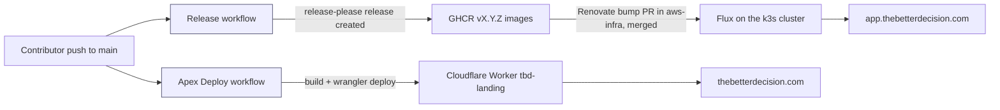
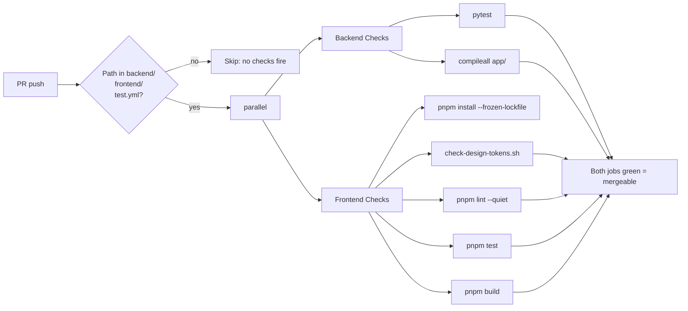
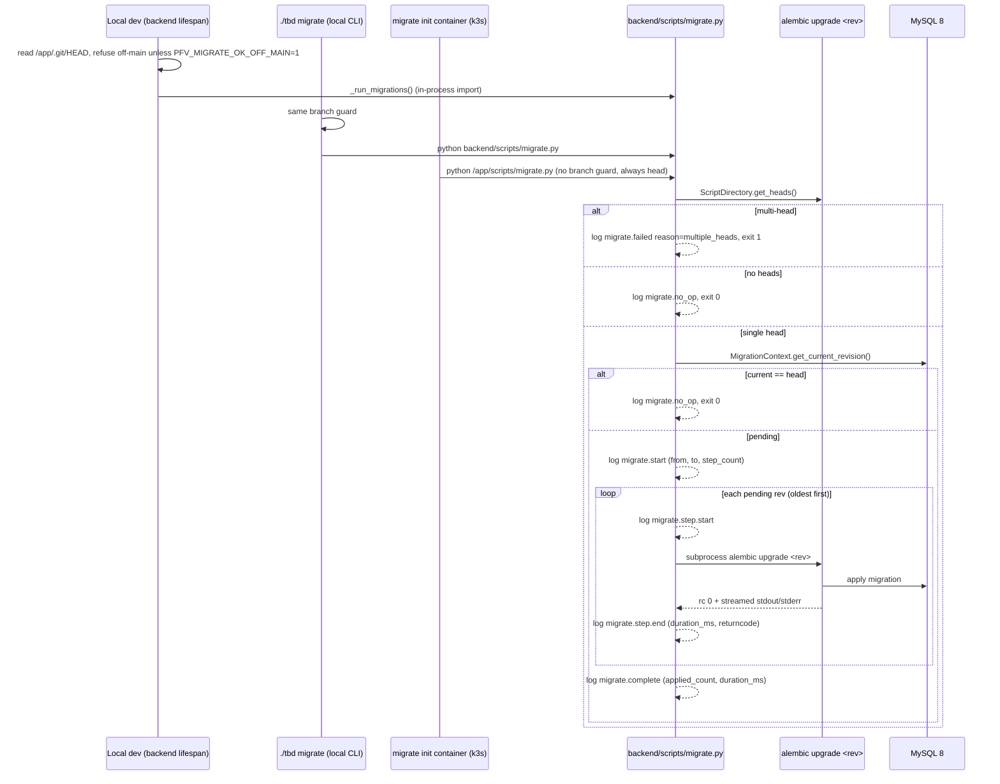
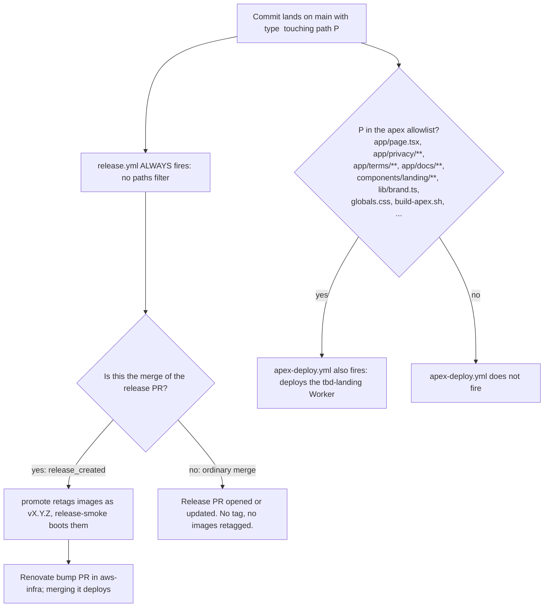

# DEPLOYMENT.md

Audience: a contributor who just cloned the repo and wants to understand what happens between `git push` and a live change at `app.thebetterdecision.com` or `thebetterdecision.com`. Also a triage reference for CI/CD failures.

All four pipelines described here are live on `main` today (`test.yml`, `release.yml`, `apex-deploy.yml`, `test-durations.yml`). The apex landing is public at `https://thebetterdecision.com` (and `https://www.thebetterdecision.com`, which 301-redirects to the apex).

For "how do I get my code ready to push", read [`CONTRIBUTING.md`](../../CONTRIBUTING.md). For the env var matrix, read [`ENVIRONMENT.md`](ENVIRONMENT.md). Production runs in `fjcloudaiconsulting/aws-infra`; this repo builds and releases the images, that one deploys them. This file does not duplicate either.

## 1. Overview

Three production surfaces. Each has its own pipeline. Some changes fan out across more than one.

| Surface | URL | Hosted by | Updated by |
|---|---|---|---|
| App (FastAPI + Next.js dashboard) | `https://app.thebetterdecision.com` | Single-node k3s cluster, namespace `tbd-prod` (aws-infra) | `release.yml` publishes the `vX.Y.Z` images; merging the Renovate bump PR in aws-infra deploys them |
| Apex landing (marketing, privacy, terms, docs) | `https://thebetterdecision.com` | Cloudflare Worker `tbd-landing` | `apex-deploy.yml` (auto) |



The apex Worker is deployed by GitHub Actions through the Cloudflare API. The app, its MySQL and Valkey, and their backups are described in aws-infra (see [Where to look](#8-where-to-look-when-something-breaks)).

## 2. PR lifecycle (`test.yml`)

Source: `.github/workflows/test.yml`.

`test.yml` is the only CI workflow that runs on PRs. It does **not** deploy anything. Its job is to fail loud before code reaches `main`.

Triggers:
- `pull_request` with path filter on `backend/**`, `frontend/**`, or `.github/workflows/test.yml`
- `workflow_dispatch` (manual)

`concurrency.group = test-${workflow}-${ref}` with `cancel-in-progress: true`. Pushing a new commit to the PR cancels the prior run.

Two jobs run in parallel:

| Job | Steps | Failure means |
|---|---|---|
| **Backend Checks** | Python 3.12, `uv sync --locked` (uv version pinned in `test.yml`), `pytest`, then `python -m compileall backend/app` | Pytest failed, or a syntax error slipped in that pytest didn't reach |
| **Frontend Checks** | Node 22, `pnpm install --frozen-lockfile`, `scripts/check-design-tokens.sh`, `pnpm lint --quiet`, `pnpm test`, `pnpm build` | One of: design-token violation, lint error, test failure, production build failure |

Both must pass for merge (branch protection rule).



How to read failures:
- **Design tokens**: `frontend/scripts/check-design-tokens.sh` scans for hard-coded colors / spacings that should use brand tokens. Output names the file and line.
- **Lint**: `pnpm lint --quiet` shows only errors (warnings are tolerated; treat warnings shown in logs as informational).
- **Frontend build**: a build failure here means it will also fail in production. Test locally with `docker compose exec frontend pnpm build`.
- **Pytest**: known-flaky `tests/app/transactions-page.test.tsx` does not run here (that's a Jest test). For backend flake see `~/.claude/projects/-Users-flamarion-src-tbd/memory/` references; otherwise the failure is real.

Re-run a single job from the PR's Checks tab.

### 2b. Shard timing maintenance (`test-durations.yml`)

Source: `.github/workflows/test-durations.yml`. Added by TBD-421.

`test-durations.yml` deploys nothing. It regenerates `backend/.test_durations`,
the per-test timing file `pytest-split` uses to balance `test.yml`'s
`Backend Shard` matrix.

- **Triggers:** `workflow_dispatch`, a monthly `schedule`, and `pull_request`
  limited to changes to the workflow file itself (so a PR editing the generator
  proves it still works).
- **Output:** a `test-durations` artifact. A human downloads it and commits it
  through an ordinary PR.
- **Not a required status check**, and it must never become one — it runs the
  whole suite unsharded and takes ~30 minutes.

⚠ **It is deliberately a separate workflow, not a step in `test.yml`.**
`scripts/ci/await-test-run.sh` gates production releases on the **run-level**
conclusion of `test.yml`, so an artifact upload added there would let a
transient upload failure block a release for reasons unrelated to the tests.

⚠ **Do not regenerate the file locally.** `/app/.test_durations` is root-owned
while the backend container runs as uid 1001, so `--store-durations` runs the
whole suite and *then* dies at `pytest_sessionfinish`. Local per-test times are
also measurably not a uniform rescaling of runner times.

`backend/tests/test_test_durations_freshness.py` fails the build when the file
drifts too far from the collected suite.

## 3. Release and image promotion (`release.yml`)

Source: `.github/workflows/release.yml`.

`release.yml` is the **single arbiter** of "should we cut a release". It runs on every push to `main` and uses **release-please** (via the Release GitHub App token, environment `release`): an ordinary merge only opens or updates the release PR (`chore(main): release X.Y.Z`), which accumulates every change; a release happens exactly once, when the owner merges that PR. On that merge `release` tags `vX.Y.Z` on the release commit and publishes the GitHub Release (`release_created`). Only then do the gated jobs run: `promote` (shared promote-release workflow retags the `sha-<7>` GHCR images `ghcr.io/fjcloudaiconsulting/tbd/{backend,frontend,migrations}` built by `test.yml` on that commit as `vX.Y.Z`) and `release-smoke` (shared smoke workflow boots those images with `compose.smoke.yaml`, runs the migrations twice, and checks `/health` returns the version and revision). Before `release` runs, `await-tests` waits for the `Test` workflow on this sha, and `release` additionally waits for the `Test` run of the merged release PR's commit when that is not this run's commit.

**Nothing in this repo deploys.** Production is the k3s cluster in `fjcloudaiconsulting/aws-infra`: Renovate opens a PR there bumping the `vX.Y.Z` image tags in `clusters/platform/tbd-prod/`, and merging it is the deploy (Flux applies it). aws-infra's `release-drift-probe` opens an issue when a published release has not reached `clusters/`.

### Trigger

```yaml
on:
  push:
    branches: [main]
```

There is **no `paths:` filter** (TBD-424). Every push must reach release-please, or the release PR goes stale and the merged one is never tagged. The ship/no-ship call is the owner merging the release PR; conventional commit types (`feat:`, `fix:`, etc) only decide the version bump and CHANGELOG section.

Why this design: merging a `feat:`/`fix:` PR no longer releases by itself, so versions ship once per release, when the owner decides, instead of on every merge.

### Job graph

```mermaid
sequenceDiagram
  participant Owner
  participant GH as GitHub Actions
  participant SR as release-please
  participant GHCR as GHCR
  participant RN as Renovate (aws-infra)
  participant K as k3s cluster (Flux)

  Owner->>GH: merge PR to main
  GH->>SR: run release job (after await-tests)
  SR->>SR: analyze conventional commits since last tag
  alt release_created == true (release PR merged)
    SR->>GH: tag vX.Y.Z, GitHub Release
    GH->>GHCR: promote: retag sha-<7> images as vX.Y.Z
    GH->>GH: release-smoke: boot the images (compose.smoke.yaml)
    RN->>RN: open PR bumping tags in clusters/platform/tbd-prod/
    Owner->>RN: merge the bump PR
    RN->>K: Flux applies; migrate init container runs, then backend and frontend roll
  else ordinary merge
    SR-->>GH: open or update release PR, skip promote and release-smoke
  end
```

### The gate

```yaml
promote:
  needs: release
  if: needs.release.outputs.release_created == 'true'
```

This is the load-bearing line (see `.github/workflows/release.yml` for the exact expression). Without `release_created`, `promote` and `release-smoke` do not run and nothing is retagged. The output is set by release-please only when the merge is the release PR. `backend/tests/test_release_workflow.py` fences the workflow's shape.

### Production rollout (aws-infra)

The bump PR changes the image tags of the backend, frontend, scheduler and migrations in `clusters/platform/tbd-prod/`. Migrations run as the `migrate` init container of the backend pod (`python /app/scripts/migrate.py`, `migrations` image), so a new version never serves on an old schema; see `https://github.com/fjcloudaiconsulting/aws-infra/blob/main/clusters/platform/tbd-prod/backend.yaml` and Section 5. Following a rollout: [aws-infra runbooks, "Follow Flux and rollouts"](https://github.com/fjcloudaiconsulting/aws-infra/blob/main/docs/runbooks.md).

### Smoke tests

`scripts/smoke-test.sh` is run by the post-deploy smoke from aws-infra `post-deploy-smoke.yml` (INFRA-114) after a production rollout. Env: `SMOKE_BASE_URL=https://app.thebetterdecision.com`, plus `SMOKE_USERNAME` / `SMOKE_PASSWORD` for a dedicated smoke user, read from the SOPS Secret `tbd-prod/tbd-smoke` (there are no GitHub secrets for them). The smoke user must exist, must be `email_verified`, and must **not** have MFA enabled. The exact command, the credentials' location and rotation are in [aws-infra runbooks, "TBD smoke account"](https://github.com/fjcloudaiconsulting/aws-infra/blob/main/docs/runbooks.md).

#### ⚠ The smoke account cannot have MFA, and that is an accepted risk (TBD-371)

`smoke-test.sh` authenticates with `POST /api/v1/auth/login` and expects a
`TokenResponse`. With MFA enabled that endpoint returns an `MfaChallengeResponse`
(`mfa_required` + `mfa_token`) instead, and the smoke test cannot proceed. Making
it proceed would mean storing the account's **TOTP seed** as a secret, a
shared secret that mints valid codes forever, which is strictly worse than no
second factor at all.

So the account stays single-factor. The compensating controls are:

1. **Its username is not published.** It lives in the cluster Secrets
   `tbd-prod/tbd-smoke` and the founder-count exclusion (SOPS, in aws-infra),
   never as a plaintext value in source, a manifest or a GitHub secret.
2. **A strong, rotated credential**, also in `tbd-prod/tbd-smoke`.
3. **No PLATFORM rights, and a blast radius of one throwaway org.**

   ⚠ It IS `role: owner`, of its own dedicated organization, and that is not
   avoidable: `register` hardcodes `role=Role.OWNER` and creates a fresh org
   per signup (`routers/auth.py:386-395`), so a standalone account cannot hold
   a lesser role. A lower role would need a second org and an invitation.

   What is actually load-bearing, and what to verify:

   * **`is_superadmin` must be 0.** That is the platform flag, and it is the
     difference between "owner of an empty org" and "owner of the fleet". It is
     written only at construction and has no promote path
     (`is_superadmin=is_first_user_setup`), so only the very first account on
     an install gets it, but verify rather than assume (query the `users` table
     for the smoke account's row).

   * **Its org holds nothing of value.** The smoke test reads
     `GET /api/v1/categories` and writes nothing, so the org should contain
     only the bootstrap categories. Never point the smoke account at a real
     tenant.

⚠ Usernames are enumerable through `POST /api/v1/auth/check-username` by design,
so a non-published name is not secrecy, it just means an attacker must guess
rather than be handed a confirmed-valid, MFA-less target.

⚠ **Renaming is the part that actually remediates a disclosure.** A username
that was ever in git history is known forever, so rotating the password alone
leaves a known, MFA-less account name reachable at the public login form. The
aws-infra runbook above covers the password rotation. A rename is
`PUT /api/v1/users/me` as the smoke account, then the new name goes into
`tbd-prod/tbd-smoke` and `FOUNDER_COUNT_EXCLUDE_USERNAMES` in the same change.

### How to verify a rollout

1. Watch the Release run: `https://github.com/fjcloudaiconsulting/tbd/actions/workflows/release.yml`
2. Follow the aws-infra bump PR and the Flux apply (runbook above); `kubectl -n tbd-prod logs deploy/backend -c migrate` shows the structured `migrate.*` JSON events.
3. Inspect the running app: `curl -fsS https://app.thebetterdecision.com/health`, `curl -fsS https://app.thebetterdecision.com/ready`, and `curl -fsS https://app.thebetterdecision.com/health/dependencies`.
   `/ready` is the database-only rotation gate; `/health/dependencies` is the one that also covers Redis, and therefore the one that tells you whether anybody can log in.

## 4. Apex landing deploy (`apex-deploy.yml`)

The apex landing (`thebetterdecision.com`) is a Next.js static export (`frontend/scripts/build-apex.sh` produces `frontend/out-apex/`) served by the Cloudflare Worker `tbd-landing` (code in `frontend/apex-worker/`). `www` is a proxied Cloudflare record that a redirect rule 301s to the apex (zone managed in aws-infra `terraform/cloudflare`).

The workflow runs on every push to `main` whose paths match the filter at the top of `.github/workflows/apex-deploy.yml` (and on `workflow_dispatch`). The `deploy-worker` job builds the export and runs `wrangler deploy`. It needs one secret, `CLOUDFLARE_API_TOKEN`, in the `landing` environment (deployment branches: `main` only), and skips with a notice while it is unset. No AWS credentials or repository variables are involved.

Shared paths (`frontend/lib/brand.ts`, `frontend/public/**`, `frontend/package.json`, etc.) are also built by `release.yml`, so a change to any of them legitimately fires both pipelines. Landing-only paths only fire `apex-deploy.yml`.

### How to verify an apex deploy

1. Watch the workflow run: `https://github.com/fjcloudaiconsulting/tbd/actions/workflows/apex-deploy.yml`
2. Confirm the deployed commit SHA: `curl -fsS https://thebetterdecision.com/_meta.json`

Rollback is in Section 7.


## 5. Database migrations

`backend/Dockerfile` is multi-stage with two named targets, both built from a venv made in a separate `builder` stage:

| Target | Runs | Build |
|---|---|---|
| `prod` (last stage, so the default) | uvicorn on :8000 | `docker build --target prod -t tbd-backend backend` |
| `migrations` | `python /app/scripts/migrate.py`, one-shot, exits 0/non-zero | `docker build --target migrations -t tbd-migrations backend` |

Both need `DATABASE_URL` and the usual app secrets at run time. `INSTALL_DEV=true` (local compose) adds pytest to the venv.

Three callers, one engine.



### The three callers

1. **Local dev (backend lifespan)**: `./tbd start | restart | rebuild` boots the backend. Its FastAPI lifespan calls `_run_migrations()` against the shared MySQL volume in dev. The lifespan reads `/app/.git/HEAD` and **refuses to migrate when the host checkout is on a non-main branch** (or is detached / unreadable). Override with `PFV_MIGRATE_OK_OFF_MAIN=1` in `.env` or the shell.
2. **`./tbd migrate` (local CLI)**: same branch guard. Runs inside the local backend container. Never invoke from an agent worktree (it has no `-p` flag and targets the checkout's default compose project, `tbd` in the main checkout). See `reference_shared_mysql_volume_trap.md`.
3. **Production (`migrate` init container)**: the `migrations` image runs `python /app/scripts/migrate.py` as an init container of the backend pod in aws-infra (`clusters/platform/tbd-prod/backend.yaml`), so the backend does not start until it exits 0. A MySQL `GET_LOCK` in alembic's `env.py` serializes concurrent migrators. The same wrapper is also used by the `migrate` service in `docker-compose.prod.yml`.

### What the wrapper guarantees

- Same exit code semantics as `alembic upgrade head` (0 on success, alembic's exit code on failure, 1 on safety errors). Init-container contract preserved.
- Same stdout / stderr from alembic, line-buffered through threaded forwarders. No capture, no reorder.
- **Multi-head guard**: if `ScriptDirectory.get_heads()` returns >1, the wrapper logs `migrate.failed reason="multiple_heads"` and exits 1. Refuses to auto-pick.
- **Per-step structured JSON events**: an operator triaging from logs alone can answer "did the migrate job do anything, and if so what?":
  - `migrate.start` (from_revision, to_revision, step_count, dialect, database)
  - `migrate.step.start` (revision, step_index, step_count, description)
  - `migrate.step.end` (revision, duration_ms, returncode=0)
  - `migrate.complete` (from_revision, to_revision, applied_count, duration_ms)
  - `migrate.no_op` (when current already equals head)
  - `migrate.failed` (revision, step_index, returncode, reason, error_type)
- Redaction: never logs raw connection URLs (driver errors routinely embed credentials). Only `dialect` and `database` name from `safe_url_fields`.

### Migration policy

- **Forward-only in production.** `alembic downgrade` is forbidden in agent contexts per `feedback_agent_destructive_db_ops`. Rollback path is "write a new fix-up migration" (see Section 7).
- Migrations land via the same PR that uses them. The `migrate` init container applies them on the next prod rollout, **before** the backend with the new code starts.

For env var detail (`DATABASE_URL`, `APP_ENV`, etc.) on the migrate container, see [`ENVIRONMENT.md`](ENVIRONMENT.md) "Migrate init container".

## 6. What triggers what (decision tree)

⚠ **`release.yml` has NO `paths:` filter (TBD-424, 2026-08-20).** Every push to
`main` starts a Release run, whatever it touched, a README-only merge included.
What a run then *does* is decided further down the pipe, in two steps:

1. **release-please decides what goes into the release PR**, from the merged
   commit's conventional-commit type (see `release-please-config.json`). It
   only opens or updates the PR; it never tags on an ordinary merge.
2. **`release_created` decides whether images are promoted.** It is set only on
   the merge of the release PR. Any other merge means `promote` and
   `release-smoke` are skipped. Nothing reaches production until the Renovate
   bump PR in aws-infra is merged.

So the common outcome for a non-shipping merge is a Release run that
concludes in about a minute having done nothing, rather than no run at all.
That is deliberate: a path filter cannot distinguish `chore(frontend):` from
`feat(frontend):`, and silently folds a filtered-out merge's commits into
whatever merge next touches an allowlisted path.



Backups and platform Terraform changes are made in the aws-infra repo.

Concrete cases:

| You changed | Fires |
|---|---|
| `backend/app/routers/transactions.py` (feat) | `release.yml` updates the release PR; on its merge: release -> promote -> release-smoke. Production rolls when the aws-infra bump PR is merged (migrate init container runs first, no-op if no new revs) |
| `frontend/components/dashboard/Foo.tsx` (feat) | Same path; the frontend image rolls with the bump PR |
| `frontend/app/page.tsx` (feat, landing) | `apex-deploy.yml` deploys the landing. `release.yml` **also runs** and updates the release PR. |
| `frontend/lib/brand.ts` (feat) | Both `release.yml` AND `apex-deploy.yml`. |
| `backend/alembic/versions/abc_new_migration.py` | release PR merge -> promote -> aws-infra bump PR merge -> `migrate` init container applies it -> backend starts |
| `.github/workflows/test.yml` | `test.yml` triggers itself (it has no paths filter either). On merge, `release.yml` runs and only updates the release PR. |
| `README.md` only | `release.yml` **runs** and only updates the release PR. Nothing is tagged. |

⚠ A landing-only commit does not skip `release.yml`: if its commit type
warrants a version, it enters the release PR. That is the correct behaviour:
the version line should reflect what shipped. `apex-deploy.yml` keeps its own
`paths:` filter. It is the only hand-maintained path allowlist in the repo, and
it is known to have drifted (`features/`, `compare/`, `vs/`,
`lib/dataPolicy.ts`), tracked as **TBD-433**.

## 7. Rollback playbook

Forward-only philosophy across the board. "Rollback" means "publish a new state that undoes the bad state", not "revert state in place".

### App (production cluster)

Revert the image-bump PR in aws-infra and merge it; Flux rolls the previous tags back. The `migrate` init container only moves the schema forward, so a rollback across a migration needs a fix-up migration (see "Database migrations" below). To undo the code itself, revert the merge commit here (`git revert -m 1 <merge-sha>`, PR, merge) and ship it through the next release.

### Apex landing (`apex-deploy.yml`)

Revert the merge commit (PR, merge); the path filter re-triggers `apex-deploy.yml`, which redeploys the Worker. Alternatively `wrangler rollback` (or the Workers dashboard -> `tbd-landing` -> Deployments) restores a prior Worker version immediately.

### Terraform

Revert the merge commit in aws-infra. TFC plans the inverse change on the next merge. Operator clicks Confirm & Apply. State catches up.

For destructive teardown (rare), queue a `Destroy plan` from the TFC workspace UI. Local `terraform destroy` is debug-only.

### Database migrations

Forward-only. **Never `alembic downgrade` in production.** The path to a safe rollback is:

1. Open a PR with a new alembic revision that performs the data and schema fix-up. Conventional title `fix(db): ...`.
2. Merge, then merge the release PR, then the aws-infra bump PR. The `migrate` init container applies the fix-up revision and the backend starts on top.
3. Verify via the new revision's `migrate.step.end` event in `kubectl -n tbd-prod logs deploy/backend -c migrate`.

If a migration **partially applies** and the container exits non-zero, the backend pod never starts and, since the Deployment uses `strategy: Recreate`, the old pod is already gone: the API is down until a fix-up revision or an image revert is rolled out. Diagnose from the streamed alembic output + the `migrate.failed` event (`reason`, `step_index`, `revision`). Fix-up paths:
- Schema state matches a known earlier revision: stamp it (`alembic stamp <rev>`) via a one-shot ops session and ship a new revision that completes the work. Only the operator should do this; agents must not (`feedback_agent_destructive_db_ops`).
- Data corruption: write a fix-up migration; ship that. Database restore: [`clusters/platform/data/RESTORE.md`](https://github.com/fjcloudaiconsulting/aws-infra/blob/main/clusters/platform/data/RESTORE.md) in aws-infra.

## 8. Where to look when something breaks

| Surface | Where the logs live |
|---|---|
| GitHub Actions runs (all workflows) | `https://github.com/fjcloudaiconsulting/tbd/actions` |
| `release.yml` runs specifically | `https://github.com/fjcloudaiconsulting/tbd/actions/workflows/release.yml` |
| `apex-deploy.yml` runs | `https://github.com/fjcloudaiconsulting/tbd/actions/workflows/apex-deploy.yml` |
| `test.yml` runs | `https://github.com/fjcloudaiconsulting/tbd/actions/workflows/test.yml` |
| Production rollout, Flux, backend/frontend logs, `migrate` init container logs | [aws-infra `docs/runbooks.md`](https://github.com/fjcloudaiconsulting/aws-infra/blob/main/docs/runbooks.md), "Follow Flux and rollouts" |
| MySQL / Valkey (namespace `data`), backups and restore | [aws-infra `clusters/platform/data/RESTORE.md`](https://github.com/fjcloudaiconsulting/aws-infra/blob/main/clusters/platform/data/RESTORE.md) |
| Release published but not on the cluster | The `release-drift-probe` issue in aws-infra |
| Apex Worker logs and versions | Cloudflare dashboard -> Workers & Pages -> `tbd-landing` |
| Smoke-test failure GitHub issue | Auto-opened by `scripts/notify-smoke-failure.sh`; check open issues in `fjcloudaiconsulting/tbd` |

Triage shortcuts:

| Symptom | First look at |
|---|---|
| Merge to `main` happened, prod didn't update | `release.yml` -> did `release` set `release_created=true`? Only the merge of the release PR cuts a release, and production only changes when the aws-infra bump PR is merged |
| `release` job failed after the release PR merged | The Test run of the release PR's commit is red. Re-run that commit's failed Test jobs (not a `workflow_dispatch` run), then re-run the failed Release run (or wait for the next push to `main`) |
| Release created but `promote` or `release-smoke` failed | Re-run the failed jobs of that Release run; the release already exists, so a new push to `main` will not redo them |
| Release published, no bump PR in aws-infra | Renovate, then the `release-drift-probe` issue |
| `release` job red after release-please already published the GitHub Release | `promote` never ran and a re-run cannot recover it (release-please finds the release and reports no `release_created`). Retag that commit's `sha-<7>` images as `vX.Y.Z` by hand, as `promote-release.yml` does; otherwise `release-drift-probe` flags it after its grace days |
| Rollout done, app still broken | Check the aws-infra `post-deploy-smoke.yml` run (INFRA-114) or run `scripts/smoke-test.sh` (runbook above), then the backend/frontend pod logs |
| `migrate` init container hung or failed | `kubectl -n tbd-prod logs deploy/backend -c migrate`. Grep for `migrate.start`, `migrate.failed`, `migrate.step.start`. Multi-head? Driver error? |
| Apex site shows stale content | Confirm the `deploy-worker` job of `apex-deploy.yml` ran for the SHA (it skips green while `CLOUDFLARE_API_TOKEN` is unset in the `landing` environment); `curl https://thebetterdecision.com/_meta.json` |
| App can't reach MySQL or Valkey | Check the `data` namespace pods and the `DATABASE_URL` / `REDIS_URL` keys in the `tbd-prod` secret (aws-infra) |
| Secret env var missing or wrong after a rollout | `clusters/platform/tbd-prod/*.secret.yaml` in aws-infra; the runbook's "Write or rotate a Kubernetes Secret" |

For the env var matrix and common per-variable failures (Google SSO button missing, audit log shows ingress IP, etc.), see [`ENVIRONMENT.md`](ENVIRONMENT.md) "Common failure modes".
