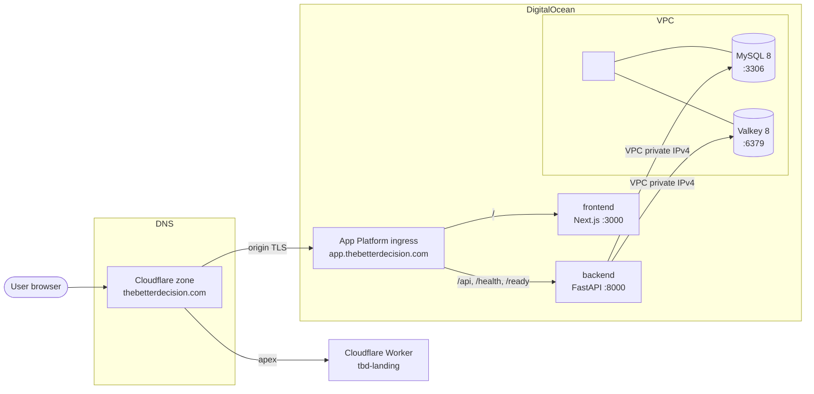

# pfv infra

> **Note on placeholders.** Concrete production identifiers — droplet and
> firewall names, resource IDs, the VPC range, the region and Terraform Cloud
> workspace names — are held in the maintainer's internal records rather than in
> this public repository, and appear below as `<placeholders>`. The Terraform and
> Ansible **code** is unchanged and remains the source of truth for how the
> infrastructure is built; only the prose specifics were removed. Real values are
> supplied at apply time via `terraform.tfvars` and the Ansible inventory, neither
> of which is committed. They will be restored here if the repository becomes
> private.


End-to-end infrastructure for The Better Decision (pfv). Two platforms, one app.

- **Cloudflare** owns the apex marketing landing site at `thebetterdecision.com`
  (Worker `tbd-landing`, deployed by `apex-deploy.yml`; DNS in aws-infra `terraform/cloudflare`).
- **DigitalOcean** owns the app itself at `app.thebetterdecision.com`
  (App Platform fronting the Next.js frontend and FastAPI backend) plus the
  self-hosted data plane (`<data-droplet>`: MySQL 8 + Valkey 8) inside a private
  VPC. Managed by Terraform Cloud workspace `<tfc-org>/<data-workspace>` against
  `infra/terraform/` (root + `modules/`).

App Platform spec lives at `.do/app.yaml`. The migration runbook for the
managed-DB to self-hosted-droplet cutover lives at `infra/MIGRATION.md`.
Per-env-var documentation lives at `docs/operations/ENVIRONMENT.md`. The
day-to-day deploy walkthrough lives at `docs/operations/DEPLOYMENT.md`.

## Topology



The boundary between the Worker (apex landing) and DigitalOcean (app + data plane)
is a hard one. Different platform, different auth, different deploy path.
Both hostnames are in the Cloudflare zone.

## What's here

```
infra/
├── README.md                       # this file
├── MIGRATION.md                    # managed MySQL+Redis -> droplet cutover (historical)
├── terraform/                      # DO data droplet (TFC: <tfc-org>/<data-workspace>)
│   ├── main.tf
│   ├── outputs.tf
│   ├── variables.tf
│   ├── modules/                    # vpc/, droplet/, firewall/, project/
│   └── (backups/ lives in aws-infra: terraform/tbd-backups)
└── ansible/                        # Ubuntu 24.04 bootstrap for <data-droplet>
```

## TFC workspaces

The data workspace is VCS-driven against this repo, requires manual
Confirm & Apply on the TFC UI (no auto-apply), and runs speculative plans
on PRs. See `feedback_terraform_vcs_only`: local CLI plan/apply is
debug-only.

| Workspace | Cloud | Working dir | Trigger pattern | Auth |
|---|---|---|---|---|
| `<tfc-org>/<data-workspace>` | DigitalOcean | `infra/terraform/` | `infra/terraform/**`  | `do_token` workspace variable |

## DNS

DNS for the domain is served by Cloudflare (aws-infra `terraform/cloudflare`).
The app subdomain terminates origin TLS at Cloudflare and proxies through to
DO App Platform's ingress.

| Hostname | Authoritative DNS | Behind | Notes |
|---|---|---|---|
| `thebetterdecision.com` (apex) | Cloudflare | Worker `tbd-landing` | Static landing export, deployed by `apex-deploy.yml`. |
| `www.thebetterdecision.com` | Cloudflare | Redirect rule | Proxied record; a Cloudflare redirect rule 301s it to the apex. |
| `app.thebetterdecision.com` | Cloudflare | DO App Platform ingress | PRIMARY domain declared in `.do/app.yaml`. Cloudflare origin TLS handshake assumes this stays declared on the App Platform side; do not strip it from the spec. |
| `m.thebetterdecision.com` | Cloudflare | Mailgun EU | Outbound email only. |

## Apex landing (Cloudflare Worker)

Static-export marketing site at `https://thebetterdecision.com`. Built by the
Next.js apex export (`out-apex/`) and deployed as the Worker `tbd-landing`
(`frontend/apex-worker/`) by the `deploy-worker` job of `apex-deploy.yml`. See
`docs/operations/DEPLOYMENT.md` Section 5.

## DO App Platform

The `pfv` app fronts the live application. App ID and database IDs
shouldn't really be repeated outside of `reference_digitalocean.md`, but
the public-facing identifiers below are useful for operators reading this
file alone.

- **App URL:** `https://app.thebetterdecision.com`
- **DO-issued URL:** `<do-issued-app-url>` (still works,
  redirects)
- **App ID:** `<app-id>`
- **DO project:** `pfv` (`<do-project-id>`)
- **Region:** `<region>`
- **VPC attachment:** `<vpc-attachment-id>` (declared at
  the top of `.do/app.yaml`, required for App Platform to reach
  `<data-droplet>`'s private IPv4)

### Components

| Component | Kind | Source | Port | Instance | Notes |
|---|---|---|---|---|---|
| `backend` | service | `backend/` + `backend/Dockerfile` | 8000 | `basic-xxs` x 1 | FastAPI. Health probe `/health`. |
| `frontend` | service | `frontend/` + `frontend/Dockerfile` | 3000 | `basic-xxs` x 1 | Next.js standalone build. Health probe `/health`. |
| `migrate` | PRE_DEPLOY job | `backend/` + `backend/Dockerfile` | n/a | `basic-xxs` x 1 | `python /app/scripts/migrate.py`. Runs once per deploy before any backend replica starts (the canonical init-container pattern for App Platform). New revision is held back until the job exits 0, so a long migration never trips the backend's serving probe. See `infra/MIGRATION.md` and the migrate wrapper at `backend/scripts/migrate.py`. |

### Ingress

App Platform handles routing; nginx (used in dev) is not in the prod path.

- `/api/*`, `/health`, `/ready` -> `backend` (with `preserve_path_prefix:
  true`)
- `/` (everything else) -> `frontend`

### Secrets

Encrypted (`EV[...]`) directly in `.do/app.yaml`. The encryption is
per-app, the blobs are unreadable outside DO, and they MUST be committed
because `app_spec_location: .do/app.yaml` means the deploy workflow pushes
the entire spec on every deploy. A missing SECRET disappears from the
live app on the next push (see the 2026-04-25 incident note in
`.do/app.yaml`).

The currently bound secrets are `DATABASE_URL`, `REDIS_URL`,
`JWT_SECRET_KEY`, `MFA_ENCRYPTION_KEY`, `MAILGUN_API_KEY`,
`GOOGLE_CLIENT_ID`, `GOOGLE_CLIENT_SECRET`. `docs/operations/ENVIRONMENT.md` is the
authoritative per-var reference.

### Deployment

Deploys go through GitHub Actions (`.github/workflows/deploy.yml`) on
merge to `main`. `deploy_on_push` is set to `false` in DO so the spec
push is exclusively driven by the workflow. See `docs/operations/DEPLOYMENT.md` for the
full walkthrough.

## DO data droplet (`<data-droplet>`)

Self-hosted MySQL + Valkey on a single DigitalOcean droplet, replacing
the DO Managed MySQL + Managed Redis pair (~$30/mo) with one
`<droplet-size>` droplet (~$12/mo). DO droplet snapshots are off; the
nightly mysqldump cron is the durability floor.

- **Region:** `<region>`
- **VPC:** `<vpc-cidr>` (Terraform-managed)
- **Engines:** MySQL 8 (`:3306`), Valkey 8 (`:6379`, drop-in Redis
  replacement)
- **Firewall:** single layer, DO cloud firewall `<data-firewall>`
  (id `<firewall-id>`). UFW on the host is
  intentionally **disabled** as of PR #260. The previous two-layer
  setup (UFW + cloud firewall) was suspected of silent drops during
  VPC NAT translation; consolidating to one layer resolved the issue.
  The Ansible `common` role keeps UFW disabled idempotently.
- **Backups:** nightly `mysqldump` on the droplet
  (`/var/backups/mysql/`, log at `/var/log/mysql-backup.log`).

```
                     ┌────────────────────────────┐
                     │  DO App Platform (<region>)    │
                     │   backend + frontend       │
                     └──────────────┬─────────────┘
                                    │ VPC private IPv4
                                    ▼
              VPC <vpc-cidr> ┌────────────────────────────┐
                               │  <data-droplet> (<droplet-size>) │
                               │   - MySQL 8 (3306)         │
                               │   - Valkey 8 (6379)        │
                               │   - cloud FW <data-firewall>   │
                               │   - nightly mysqldump      │
                               └────────────────────────────┘
                                    ▲
                                    │ SSH (key auth), public IPv4
                                    │
                                  operator
```

DO Cloud Firewall: SSH 22 from any IPv4, MySQL 3306 + Valkey 6379 from
VPC CIDR only. ICMP from VPC.

## Prerequisites (DO side, `<tfc-org>/<data-workspace>`)

- A DO API token with read/write scope. In normal operation it lives as
  the `do_token` workspace variable in TFC; local CLI debug runs against
  the same workspace need `TF_VAR_do_token` (or a gitignored
  `terraform.tfvars`).
- An SSH key already registered in DO (Settings -> Security). Note its
  name.
- A DO project named `pfv` (or change `project_name`). Projects must be
  created from the UI or `doctl` first; Terraform does not manage them.
- Local tooling: `terraform >= 1.5`, `ansible >= 2.16`, `doctl`
  (optional, useful for sanity checks).

## Step-by-step (data droplet)

### 1. Provision (Terraform Cloud)

State and runs live in Terraform Cloud, workspace `<tfc-org>/<data-workspace>`,
VCS-driven against this repo with the working directory and trigger
paths both scoped to `infra/terraform/`. Workflow:

1. Open a PR that touches `infra/terraform/**` . TFC
   posts a speculative plan on the run page.
2. Merge to `main`. TFC starts an apply run. Apply method is **manual
   Confirm & Apply** on the TFC UI.

The workspace expects two variables to be set ahead of time:

- `do_token` (sensitive): the DO API token.
- `ssh_key_name` (plaintext): the name of an SSH key already registered
  in DO.

After the apply succeeds, fetch the outputs from TFC (Workspace ->
Outputs) or via the CLI once `terraform login` is configured locally:

```bash
terraform -chdir=infra/terraform output droplet_public_ipv4
terraform -chdir=infra/terraform output droplet_private_ipv4
terraform -chdir=infra/terraform output -raw vpc_id
```

Local-CLI runs against the same workspace work too; `terraform login`
once, then `terraform plan` reaches the remote state.
`terraform.tfvars` is for local runs only and stays gitignored. The
`.terraform.lock.hcl` IS committed so TFC and laptops resolve identical
provider versions.

### 2. Configure (Ansible)

```bash
cd ../ansible
cp inventory.yml.example inventory.yml
$EDITOR inventory.yml
# Fill in:
#   ansible_host          = $(terraform -chdir=../terraform output -raw droplet_public_ipv4)
#   private_ipv4          = $(terraform -chdir=../terraform output -raw droplet_private_ipv4)
#   mysql_app_password    = <generated>
#   mysql_backup_password = <generated>
#   redis_password        = <generated>
#
# Note: we intentionally do NOT manage a password for root@localhost.
# Ubuntu MySQL ships with auth_socket on root, and we keep that. Local
# maintenance is `sudo mysql`. Cron mysqldump uses the dedicated
# mysql_backup user via /root/.my.cnf.

ansible-galaxy collection install -r requirements.yml
ansible-playbook playbooks/site.yml
```

Recommended: `ansible-vault encrypt_string` the three passwords or move
them into a vault-encrypted vars file. `inventory.yml` is gitignored to
keep plain-text creds out of the repo even by accident.

### 3. Wire App Platform

Update App Platform secrets (separate PR / runbook step):

```
DATABASE_URL=mysql+aiomysql://pfv_app:<password>@<droplet_private_ipv4>:3306/pfv2
REDIS_URL=redis://default:<password>@<droplet_private_ipv4>:6379/0
```

See `MIGRATION.md` for the full data-move runbook (including rollback).

## OIDC overview

The data workspace (`<tfc-org>/<data-workspace>`) does NOT use OIDC; it uses a long-lived
`do_token` workspace variable. DO Terraform Cloud OIDC for the DO
provider is not currently supported, so static-token auth is the path
there until further notice. The AWS OIDC trust for the backups workspace
lives in aws-infra.

## Day-2

### Apex landing

- **Verify**: browse `https://thebetterdecision.com/` (or its
  `_meta.json` probe for a deploy-SHA echo).
- **Rollback**: revert the merge commit (PR, merge), or
  `wrangler rollback` (or the Workers dashboard) (see `docs/operations/DEPLOYMENT.md`).

### DO App Platform

- **Logs**: DO control panel -> Apps -> pfv -> Runtime Logs (per
  component) or `doctl apps logs <APP_ID> <component>`.
- **Deploys**: GitHub Actions `deploy.yml`. Manual fallback `doctl apps
  update <APP_ID> --spec .do/app.yaml`, but the GH Action is the
  documented path; see `reference_do_spec_sync.md` for the
  `app_action/deploy@v2` gotcha that mandates `app_spec_location`.

### Data droplet

- **Inspect droplet metrics**: DO control panel -> Droplets ->
  <data-droplet> -> Graphs. CPU, memory, disk, network all graphed for
  free.
- **Watch backups**: `ls -lh /var/backups/mysql/` on the droplet. Logs
  at `/var/log/mysql-backup.log`.
- **Apply OS updates**: unattended-upgrades runs daily (`noble-security`);
  reboots are manual. ⚠ Do **not** clear a pending upgrade with a bare
  `sudo apt upgrade` on this droplet: the MySQL packages are held in the dpkg
  database (TBD-419) and will report as `kept back`, and moving them is a
  windowed operation that needs a snapshot first. The ansible play no longer
  upgrades packages on a routine converge either. Both the deliberate patch
  path (`run-playbook.sh --production -- --tags patch`) and the procedure for
  moving a held package on purpose are in `infra/MIGRATION.md`, "Data-plane
  package pins".
- **Rotate creds**: re-run the playbook with new vault values; restart
  services as the handlers fire.

## Teardown

### Data droplet (`<tfc-org>/<data-workspace>`)

Terraform is VCS-driven via TFC; teardown follows the same path. Either:

- Open a PR that removes (or comments out) the droplet / VPC / firewall
  resources in `infra/terraform/`. Merge it and run the apply via the
  TFC UI (Confirm & Apply), same as any other infra change.
- Or, for a one-shot destroy, queue a `Destroy plan` from the TFC
  workspace UI and approve it. Local `terraform destroy` is debug-only.

Warning: this destroys the droplet and its data. DO droplet snapshots
are disabled at the IaC level, so the only durability floor is the
nightly `mysqldump` on the droplet. Pull a final dump (see
`MIGRATION.md` for the command and the verify step) before queuing the
destroy.

## See also

- `infra/MIGRATION.md`: managed-MySQL+Redis to droplet cutover (already
  executed; kept as the reference writeup).
- `docs/operations/ENVIRONMENT.md`: authoritative per-env-var reference for
  every component.
- `docs/operations/DEPLOYMENT.md`: GitHub Actions deploy walkthrough.
- `~/.claude/projects/-Users-flamarion-src-tbd/memory/reference_digitalocean.md`:
  DO IDs, gotchas, and operational lore.
- `~/.claude/projects/-Users-flamarion-src-tbd/memory/feedback_terraform_vcs_only.md`:
  Terraform is VCS-driven; CLI is debug-only.

## AWS accounts and Terraform workspaces

Terraform workspaces that relate to this repo:

| Workspace | Directory | Cloud | What it owns |
|---|---|---|---|
| `FlamaCorp/tbd` | `infra/terraform/` | DigitalOcean | data droplet, VPC, cloud firewall, data-plane credentials |
| `FlamaCorp/tbd-backups` | `https://github.com/fjcloudaiconsulting/aws-infra/tree/main/terraform/tbd-backups` | AWS (**company account `884686184019`**) | off-host MySQL backup bucket, CMK, put-only uploader, probe role |

Both are VCS-driven with **manual Confirm & Apply**; auto-apply is off
everywhere.

⚠ `https://github.com/fjcloudaiconsulting/aws-infra/tree/main/aws/bootstrap` holds the trust and provisioner documents for the
backups workspace. They were applied once by hand with root at genesis (an empty
account has no other principal), then `terraform import`ed. They are the source
of truth for recovery if the OIDC trust is ever broken -- see TBD-372.
